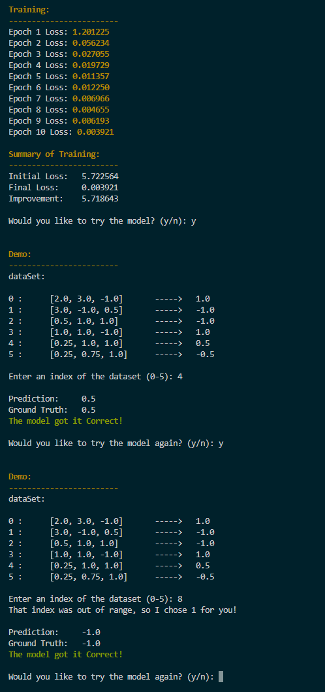

# Monkey-Grad: Like MicroGrad but more monkey code
<h3>
Making a very simple Machine Learning Model from Scratch without the use of libraries. Just a fun experiment to expand my understanding.   
</h3> 

   
  inspired by Andrej Karpathy's video series on youtube.

<h2>
  Files in this project :)
</h2>

|File                       |   Function                                                                                                                                                |
----------------------------|---------------------------------------------------------------------------------------------------------------------------------------------------------- |
|mainNotebook.ipynb         |   Notebook for prototyping the different classes, as well as testing features. Go to this file if you want to see how I made progress towards the project |
Engine.py                   |   Main Library, Collection of good code from mainNotebook.py and cleaned up all the prototype code to make it a true library                              |
MultiLayerPerceptron.py     |   Test File for a very simple Multilayer Perceptron. Run this file for a Demo :)                                                                          |
MLUtils.py                  |   Just some Utils I only really ended up using the printPurple class which essentially functions like a print statement but outputs purple text           |
visualizations              |   Folder containing some cool visualizations of the multilayer perceptron from the mainNotebook file                                                      |

## Model Demo :)

## Cool Visualization of Neural Network

